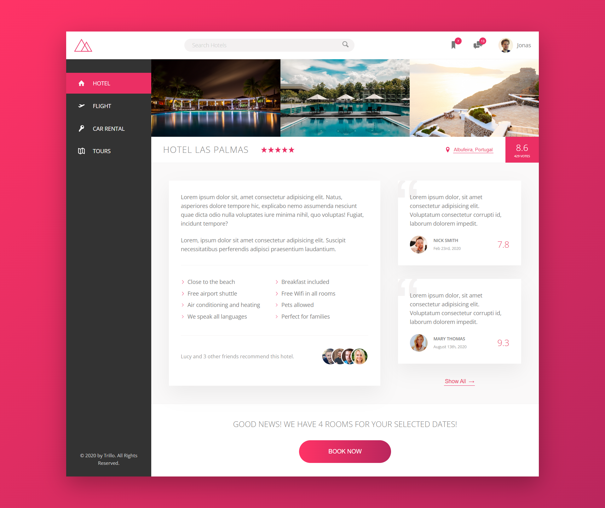

# Trillo - Static Hotel Website.

#### Welcome to Trillo, a captivating static website that showcases a world of hotels and accommodations, meticulously designed using HTML, CSS, and SCSS. Immerse yourself in the realm of hospitality as we present a visually stunning and user-friendly interface to explore and discover your ideal destinations.

 

### ⚒ Project Demo:

Experience the project in action by visiting our live demo: [Trillo - Static Hotel Website UI Demo](http://hotel-trillo.surge.sh/)

---

### 🕵️‍♂️ Project Details:

Trillo is a visually appealing hotel website that provides a virtual gateway to explore a variety of accommodations across different destinations. With its clean and modern design, Trillo captivates users by presenting a wide range of hotels, stunning imagery, and essential information in an easily accessible format.

As a static website, Trillo focuses on delivering an exceptional user experience without any complex functionality. It allows visitors to browse through a diverse collection of hotels, view room details, and find information about amenities and services. With Trillo, planning your next vacation becomes an enjoyable and hassle-free experience.

---

### 🤹‍♂️ Skills Utilized:

&nbsp;&nbsp;&nbsp;&nbsp;
&nbsp;&nbsp;&nbsp;&nbsp;
&nbsp;&nbsp;&nbsp;&nbsp;
&nbsp;&nbsp;&nbsp;&nbsp;

---

### ✔ Contributors:

We would like to acknowledge the following contributor for their valuable contributions to this project:

  &nbsp&nbsp&nbsp&nbsp&nbsp&nbsp&nbsp&nbsp&nbsp&nbsp&nbsp&nbsp

---

### 📷 Project UI:

Take a glimpse into the captivating world of Natours Tour Static Website:

  

